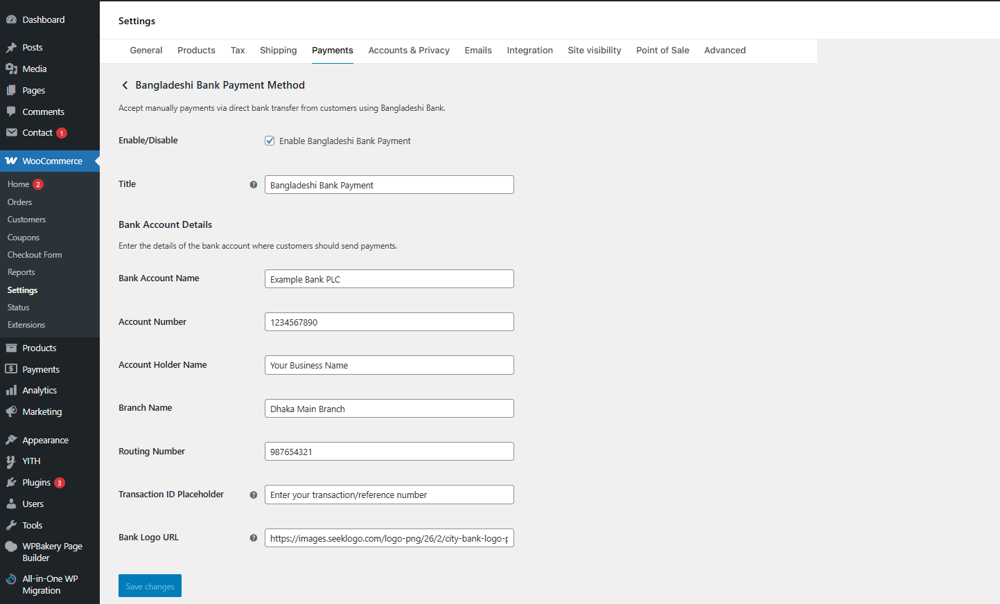
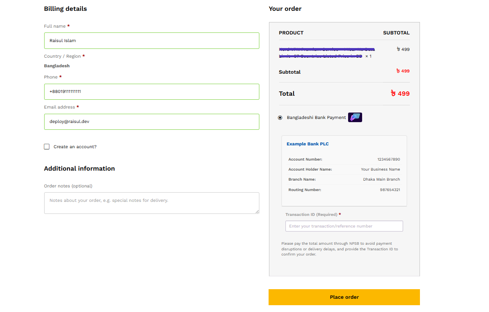
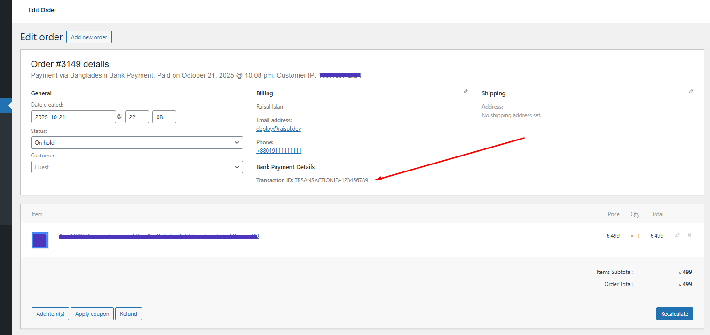

# 🏦 Bangladeshi Manual Bank Payment Method

A custom WooCommerce payment gateway designed to securely accept direct bank transfers from customers in Bangladesh, making local transactions simple and reliable.
---

## 📌 Plugin Information
- **Contributors:** shagor447  
- **Tags:** woocommerce, payment gateway, bangladesh bank transfer, manual payment, bangladeshi bank
- **Requires at least:** WordPress 4.8  
- **Tested up to:** WordPress 6.8  
- **Requires PHP:** 7.0  
- **Stable tag:** 1.0.2 
- **License:** [GPLv2 or later](https://www.gnu.org/licenses/gpl-2.0.html)  

---

## 📖 Description
This plugin adds a custom Direct Bank Transfer payment option for WooCommerce, specially designed for businesses and customers in Bangladesh.
It enables buyers to place an order and securely complete the payment by manually transferring funds to the merchant’s bank account.
Customers can then submit the transaction ID or payment reference on the checkout page for easy verification and order processing.
---

## ✨ Features
- Accept direct bank transfers from customers in Bangladesh.
- Display your bank account details on the checkout page.
- Allow customers to submit transaction IDs or payment references.
- Easily verify and confirm payments manually from the admin panel.
- Works seamlessly with WooCommerce orders and email notifications.
- Simple, secure, and ideal for businesses accepting local payments.

---

## ⚙️ Installation
- Upload the `bangladeshi-manual-bank-payment-method` folder to the `/wp-content/plugins/` directory.
- Activate the plugin through the 'Plugins' menu in WordPress.
- Go to WooCommerce -> Settings -> Payments.
- Locate "Bangladeshi Manual Bank Payment Method" and click 'Manage'.
- Configure your bank account details and save the changes.

---

## ❓ Frequently Asked Questions

### 🔹 Is this plugin compatible with all Bangladeshi banks?
Yes, it supports payments from any bank in Bangladesh that allows manual fund transfers.

### 🔹 How do customers confirm their payment?
Customers can enter the transaction ID or payment reference number on the checkout page after completing the bank transfer.

### 🔹 Does it automatically verify the payment?
No, payment verification is done manually by the store admin based on the transaction details provided.

### 🔹 Is it safe to use?
Yes, the plugin does not store any sensitive banking information and follows standard WooCommerce security practices.

---

## 🖼️ Screenshots
1. Payment management page for configuring bank details. 
2. Overview of the checkout page. 
3. Display of customer-submitted payment transaction details on the order details page. 

---

## 📝 Changelog

### 1.0.2
- Fix: Addressed security and internationalization issues flagged by the Plugin Checker.
- Minor bug fixes.
- Prevents review submission without solving captcha.

### 1.0.1
- Minor bug fixes.

### 1.0.0
- Initial release of the plugin.

---

## 📢 Update Notice
= 1.0.2 =
First stable release.

## ⚖️ License & Copyright
- Copyright © **Raisul Islam Shagor** 
- Contact: deploy@shagor.dev 
- Licensed under the **GPLv2 or later**  
- ✅ This plugin is **free to use, modify, and distribute** under the license terms.
